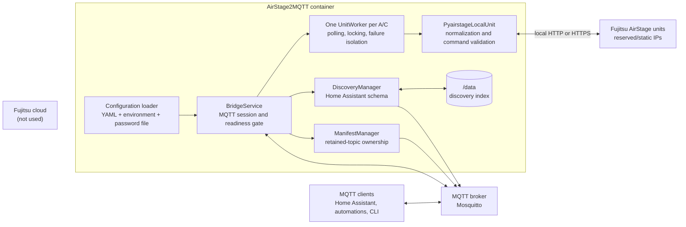
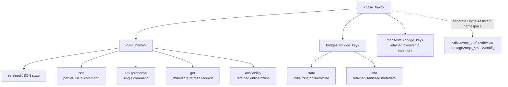
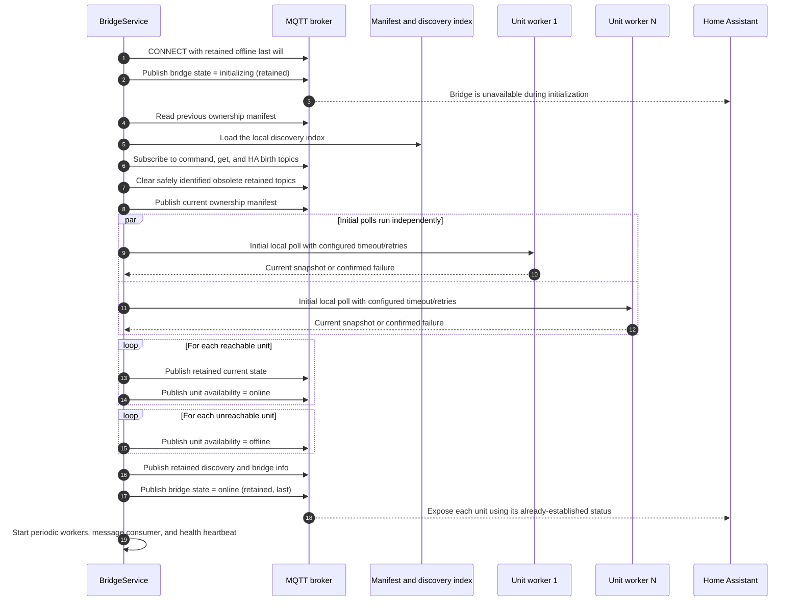
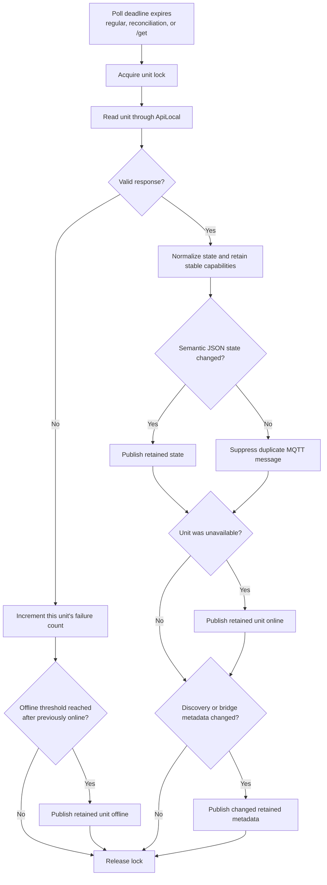
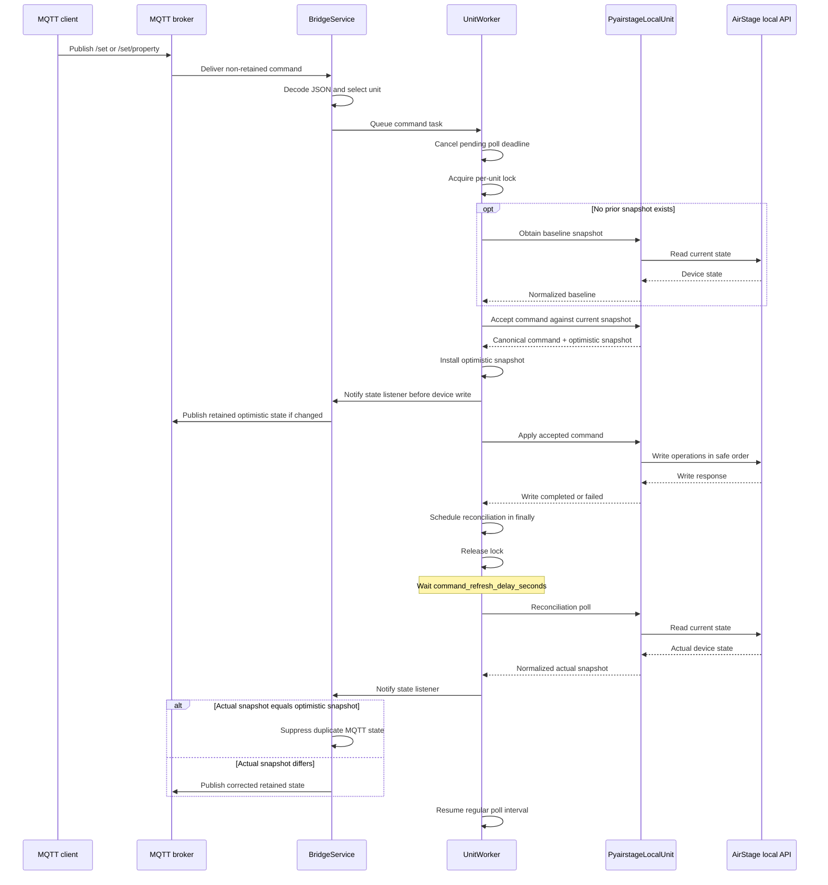
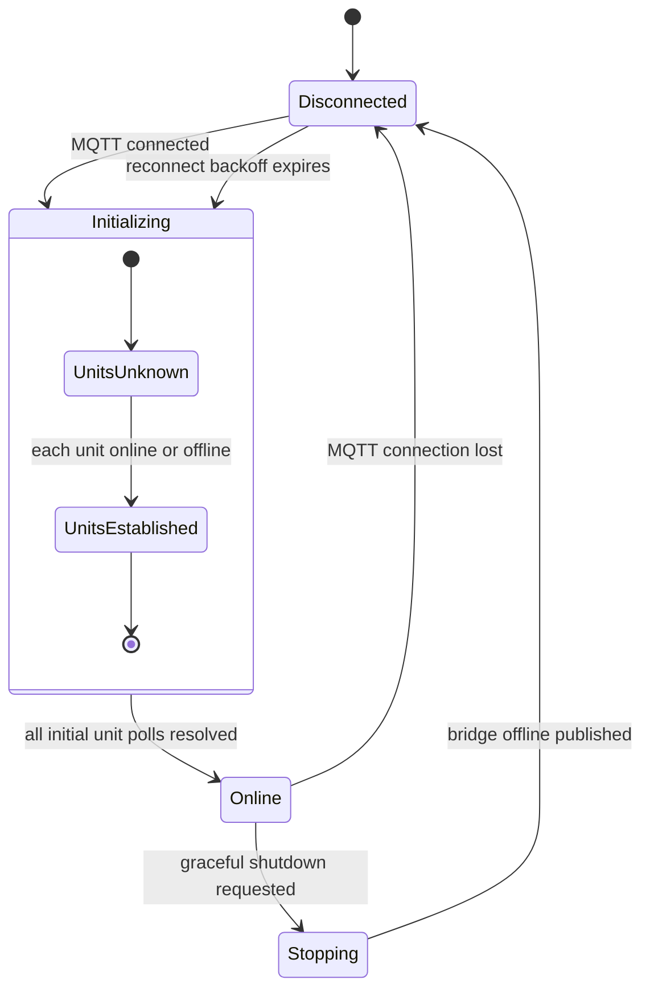
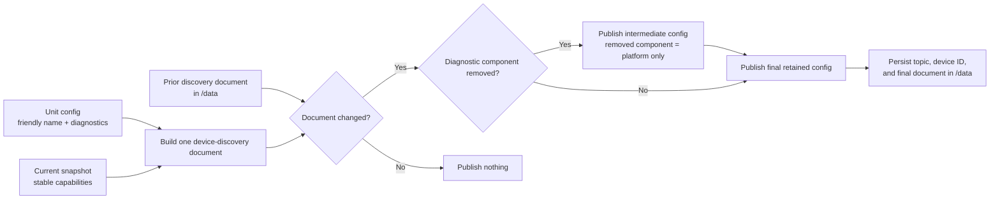
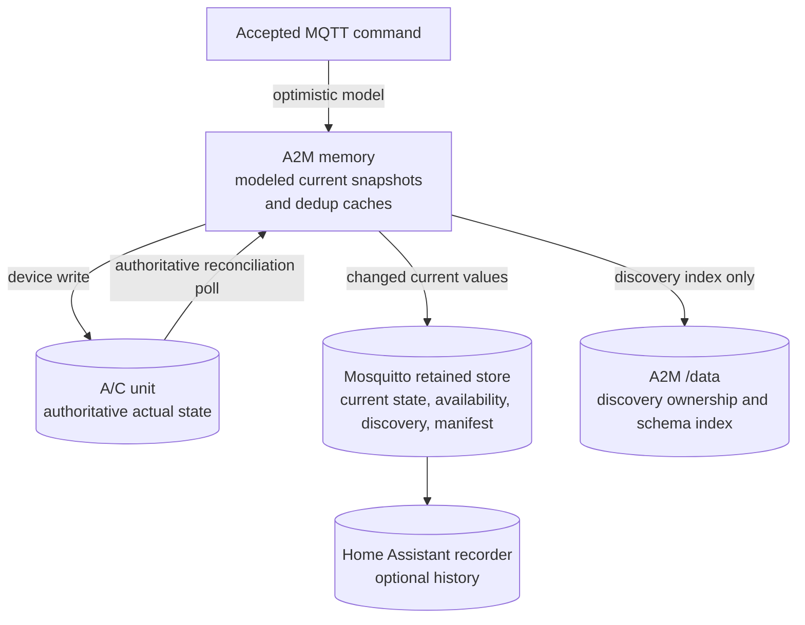

# AirStage2MQTT architecture

AirStage2MQTT is a local protocol bridge. It translates between retained MQTT state and commands
on one side and Fujitsu's AirStage LAN API on the other. There is no cloud client, cloud account,
or Internet API in the runtime path.

## System context

The cloud node is deliberately unconnected; the invisible Mermaid layout link only keeps it near
the system boundary. The service does not use the cloud. The container only needs network routes
to its MQTT broker and configured A/C addresses.

## Runtime responsibilities

| Component | Responsibility |
| --- | --- |
| `config.py` | Loads and validates MQTT, polling, discovery, bridge ownership, and per-unit settings. Environment variables override MQTT connection values; unit definitions remain in YAML. |
| `service.py` / `BridgeService` | Owns the MQTT connection, last will, subscriptions, readiness state, publish-on-change caches, and worker lifecycle. |
| `service.py` / `UnitWorker` | Serializes polling and commands for one unit, owns its reschedulable poll deadline and optimistic snapshot, tracks consecutive failures, and prevents one A/C from blocking another. |
| `airstage.py` | Uses `pyairstage.ApiLocal`, converts device responses into normalized state, tracks stable capabilities, validates and models accepted commands, and applies their device writes. |
| `discovery.py` | Builds one Home Assistant device-discovery document per A/C, suppresses identical updates, and explicitly removes disabled components. |
| `manifest.py` | Publishes the bridge-owned topic inventory and safely clears obsolete retained topics. |

The `aiohttp` session is shared, but each configured unit has its own adapter, worker, lock,
failure counter, current snapshot, and availability state. A slow or unreachable unit therefore
does not serialize polling for every other unit.

## MQTT topic layout and ownership

Only state, availability, bridge metadata, manifests, and discovery documents are retained.
Command and `/get` messages must not be retained; if a retained command is received, A2M ignores
and clears it rather than replaying it against the A/C.

`bridge.key` scopes bridge state, metadata, and the manifest. This allows several A2M instances to
share a base topic, provided their bridge keys and unit names do not collide.

## Startup and readiness

The bridge uses its own availability as a readiness gate. Home Assistant discovery maps every
bridge state other than `online` to unavailable. Unit state and availability are established
behind that gate, and `online` is always the final startup publication.

Initial polls run concurrently. Startup waits for all of them to resolve, but each unit's local API
request is bounded by its timeout and retry configuration. An unreachable unit can delay readiness
only for that bounded period and then starts as `offline`; it does not prevent the bridge or healthy
units from becoming operational.

## Polling and publish-on-change

Without commands, polling continues at `polling.interval_seconds`; publish suppression does not
reduce how often A2M checks the hardware. A command replaces the pending regular deadline with a
short reconciliation deadline. After that poll finishes, the worker returns to the regular
interval. The first successful poll after each MQTT connection republishes state so a broker that
lost retained data is repaired. Later polls publish only semantic changes.

Capabilities only grow during a process lifetime. Across restarts, the persisted discovery record
preserves prior non-diagnostic components if a response is temporarily incomplete. Diagnostic
components are determined by configuration, never by whether one individual poll happened to
contain a value.

## Optimistic command and reconciliation flow

The same lock covers normal polling and command execution, so they cannot interleave requests to
one unit. A pending poll is cancelled as soon as a command task starts; an already-running poll is
allowed to finish before the command acquires the lock. Multi-property commands are first
validated and normalized as one operation. The modeled snapshot preserves uncommanded readings
and capabilities while resolving values such as `TOGGLE`, enum aliases, Boolean controls,
temperature rounding, and power/mode side effects.

Listeners see that modeled snapshot before any device write. The write is then ordered safely—for
example, power-on can precede mode and temperature changes, while a requested power-off is applied
last. Whether the write succeeds or fails, the worker schedules an authoritative read after
`polling.command_refresh_delay_seconds` (two seconds by default). An identical full snapshot is
suppressed by the normal publish-on-change cache; any difference, including an unrelated sensor
change, is published.

Each new accepted command replaces the pending reconciliation deadline, so a burst of commands
settles with one poll after the final write. An explicit `/get` has priority over that delay and
polls as soon as the unit lock becomes available. After reconciliation completes, the next poll is
scheduled using `polling.interval_seconds`.

Invalid, unsupported, and read-only properties are rejected before listeners are notified or the
device is written. If no prior snapshot exists—for example, for a unit that was unreachable at
startup—the worker must first obtain a baseline so it can preserve a complete state document and
validate capabilities. A failed baseline read rejects the command without inventing state.

## Availability, disconnects, and restarts

The MQTT connection declares a retained `offline` last will. Mosquitto publishes it if the process,
container, or network connection disappears unexpectedly. On a graceful shutdown, A2M publishes
bridge `offline` itself before publishing per-unit offline transitions.

After MQTT failure, A2M reconnects with bounded exponential backoff and repeats the complete
initialization gate. In-memory publish caches are reset on each new MQTT session so retained state,
availability, discovery, and bridge information can repopulate a restarted broker.

Home Assistant uses both bridge and unit availability with `availability_mode: all`. Consequently:

- All A2M entities are unavailable while the bridge is initializing, disconnected, or stopped.
- Once the bridge is online, each A/C independently follows its unit availability topic.
- A runtime unit is marked offline only after `polling.offline_after_failures` consecutive failures.
- A later successful poll publishes current state before transitioning that unit back online.

## Home Assistant discovery lifecycle

One retained Home Assistant device-discovery topic represents each physical A/C and contains its
climate entity, supported sensors and switches, configured diagnostics, and a bridge-version
diagnostic sourced from the retained bridge information. Identical discovery is suppressed during
a connection. It is offered again after an A2M MQTT reconnect so broker data can be repaired; an
unchanged Home Assistant birth message does not cause repeated discovery churn.

The configurable diagnostics—`error_code`, `demand`, and `power_consumption`—are disabled by
default. Enabling one adds a diagnostic entity even if the current reading is absent; the entity
then remains stable and reports an unknown value until the unit supplies data. Disabling one uses
[Home Assistant's explicit component-removal update](https://www.home-assistant.io/integrations/mqtt/#device-discovery-payload),
followed by the final document without that component.

## Persistence boundaries

A2M deliberately does not persist readings or command history in `/data`. In memory and MQTT, an
accepted command is treated as the current modeled state until a later device poll confirms or
corrects it. The A/C remains the authoritative source for reconciliation; Mosquitto retains the
latest published model, and Home Assistant's recorder owns historical data. Mosquitto persistence
is therefore needed if retained MQTT messages must survive a broker restart.

Persisting `/data` is still recommended. It is not needed for live control, but it allows A2M to
remember discovery ownership and schema across container replacement, including clean component
removal and cleanup after topic or unit configuration changes.

## Container and security boundary

The production container runs as a non-root user with a read-only root filesystem, dropped Linux
capabilities, `no-new-privileges`, and a small writable `/tmp` used for the health heartbeat. Its
only persistent write is the discovery index under `/data`. Configuration is mounted read-only,
and the MQTT password can be supplied through a separately mounted secret file.

No deployment-specific MQTT credentials, A/C readings, MAC addresses, unit IPs, or
network-specific registry values are built into the image or committed examples.
